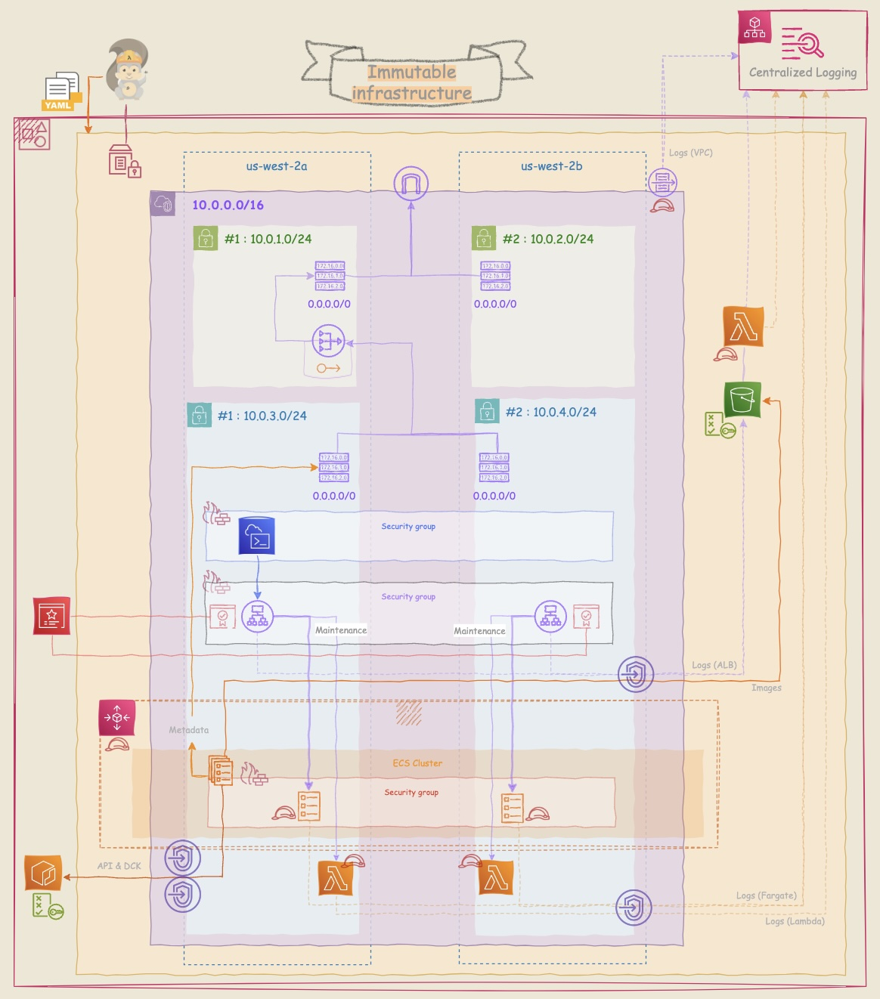

# aws-serverless-education

 

- [**Cloud-Native Application architecture: The AWS Graviton based ECS Fargate Cluster**](./Serverless_Architecture/ECSCluster/README.md)

|High-level overview|Details|
|---|---|
|||

---
