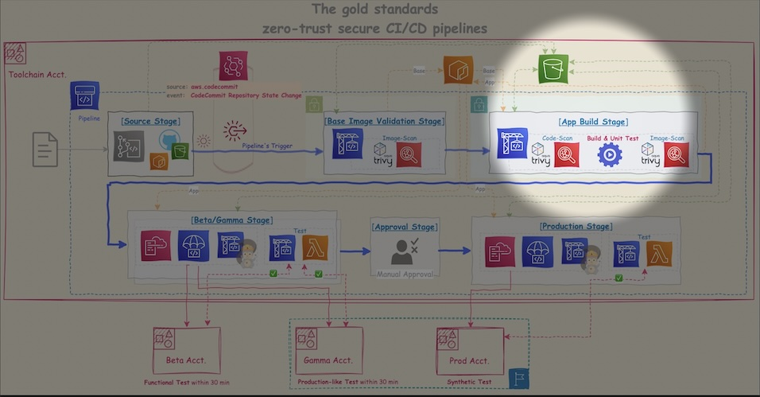

# 🛠️ Runbook: App Build Stage

<br>

||
|---|
||

---

<br>

## 🪩 Purpose

This runbook describes the **App Build Stage** in the zero-trust secure CI/CD pipeline. It performs the following responsibilities:

1. **Code scan (IaC & dependencies)**
2. **Application build and unit tests**
3. **Container image scan (Trivy)**

---

<br>

---

<br>

### 0️⃣ Prerequisites

<br>

- **🟠ECR repository structure is aligned**

```bash
Repository Name: debut/tools/trivy       # Trivy scanner image (ex: 0.62.1)
Repository Name: debut/baseImages/caddy  # Verified base images (e.g., caddy, golang)
Repository Name: debut/apps/caddy        # Application-specific container images
```

---

<br>

### 1️⃣ Variables to Set

<br>

📌 e.g., <mark>**On 🔵CloudShell**</mark> (AWS managed network)

<br>

```bash-session
### 🚨Define variables
# export AWS_REGION="us-west-2"
# ACCOUNT_ID=`\aws sts get-caller-identity | jq -r .Account`

# APPS_REPO_NAME="debut/apps/caddy" ; SCAN_TOOL_REPO_NAME="debut/tools/trivy" ; BASE_IMG_REPO_NAME="debut/base-images/caddy"
# REPOSITORY="${ACCOUNT_ID}.dkr.ecr.${AWS_DEFAULT_REGION}.amazonaws.com" ; echo ${REPOSITORY}
# SCAN_TOOL_IMAGE="${REPOSITORY}/${SCAN_TOOL_REPO_NAME}:0.62.1" ; echo ${SCAN_TOOL_IMAGE}
# APP_BLUE_NAME="caddy-tls-arm64:v1.0.0" ; APP_GREEN_NAME="caddy-tls-arm64:v2.0.0"

# SCANED_REPORT_BUCKET="your-secure-scan-logs"
```

---

<br>

### 2️⃣ 📝Code Scan (Trivy)

<br>

- This step scans source code for vulnerabilities in:
  - **IaC config files** (Dockerfile, etc.)
  - **Language dependencies** (e.g., go.mod, requirements.txt)

- e.g., target config file: _Dockerfile_ARM64_Blue_

```bash-session
### Pull Trivy scanner from 🟠ECR
# \aws ecr get-login-password --region ${AWS_REGION} | docker login --username AWS --password-stdin "${REPOSITORY%/*}"
# docker pull ${SCAN_TOOL_IMAGE} ; docker images ${SCAN_TOOL_IMAGE}


### Scan the Dockerfile
# cd dockerImages
# docker run --rm -v /var/run/docker.sock:/var/run/docker.sock -v ./caddy_tls:/workdir ${SCAN_TOOL_IMAGE} config --file-patterns 'dockerfile:Dockerfile_*' /workdir --exit-code 1


# Optional: Scan Go deps
# docker run --rm -v $(pwd):/src ${SCAN_TOOL_IMAGE} fs --exit-code 1 --scanners vuln /src || exit 1
```

>```console
>2025-05-29T16:28:11Z    INFO    [misconfig] Misconfiguration scanning is enabled
>2025-05-29T16:28:11Z    INFO    [misconfig] Need to update the checks bundle
>2025-05-29T16:28:11Z    INFO    [misconfig] Downloading the checks bundle...
>165.20 KiB / 165.20 KiB [------------------------------------------------------] 100.00% ? p/s 100ms2025-05-29T16:28:16Z        INFO    Detected config files   num=6
>
>Report Summary
>
>┌────────────────────────┬────────────┬───────────────────┐
>│         Target         │    Type    │ Misconfigurations │
>├────────────────────────┼────────────┼───────────────────┤
>│ Dockerfile_AMD64       │ dockerfile │         1         │
>├────────────────────────┼────────────┼───────────────────┤
>│ Dockerfile_AMD64_Blue  │ dockerfile │         1         │
>├────────────────────────┼────────────┼───────────────────┤
>│ Dockerfile_AMD64_Green │ dockerfile │         1         │
>├────────────────────────┼────────────┼───────────────────┤
>│ Dockerfile_ARM64       │ dockerfile │         1         │
>├────────────────────────┼────────────┼───────────────────┤
>│ Dockerfile_ARM64_Blue  │ dockerfile │         1         │
>├────────────────────────┼────────────┼───────────────────┤
>│ Dockerfile_ARM64_Green │ dockerfile │         1         │
>└────────────────────────┴────────────┴───────────────────┘
>Legend:
>- '-': Not scanned
>- '0': Clean (no security findings detected)
>:
>```

<br>

>```console
>Dockerfile_AMD64 (dockerfile)
>=============================
>Tests: 28 (SUCCESSES: 27, FAILURES: 1)
>Failures: 1 (UNKNOWN: 0, LOW: 1, MEDIUM: 0, HIGH: 0, CRITICAL: 0)
>
>AVD-DS-0026 (LOW): Add HEALTHCHECK instruction in your Dockerfile
>════════════════════════════════════════
>You should add HEALTHCHECK instruction in your docker container images to perform the health check on running containers.
>
>See https://avd.aquasec.com/misconfig/ds026
>────────────────────────────────────────
>```

---

<br>

### 3️⃣ Build & Unit Test

<br>

>💡Note:  
>Always test your code before baking it into the image. Testing post-image adds latency and risk

```bash-session
### Setup Go env
GOOS=linux GOARCH=arm64 go mod tidy
go test ./... -v -coverprofile=coverage.out || exit 1

### Build the app container
DOCKER_BUILDKIT=1 docker buildx build \
  --platform linux/arm64 \
  -t "$APP_IMAGE" \
  -f Dockerfile_ARM64_Blue . \
  --load
```

---

<br>

### 3️⃣ Image Scan (Trivy)

<br>

```bash-session
### Scan the built app container image

docker run --rm \
  -v /var/run/docker.sock:/var/run/docker.sock \
  "$SCAN_TOOL_IMAGE" image --exit-code 1 --severity HIGH,CRITICAL "$APP_IMAGE" || exit 1

# Optional: Generate SBOM
mkdir -p ./output

docker run --rm \
  -v /var/run/docker.sock:/var/run/docker.sock \
  -v ./output:/output \
  "$SCAN_TOOL_IMAGE" image --format cyclonedx --output /output/sbom.$(basename "$APP_NAME").cdx.json "$APP_IMAGE"
```

---

<br>

### 3️⃣ Push to ECR (Only if Passed)

<br>

```bash-session
aws ecr get-login-password --region "$AWS_DEFAULT_REGION" | \
  docker login --username AWS --password-stdin "$ACCOUNT_ID.dkr.ecr.$AWS_DEFAULT_REGION.amazonaws.com"

docker push "$APP_IMAGE"
```

