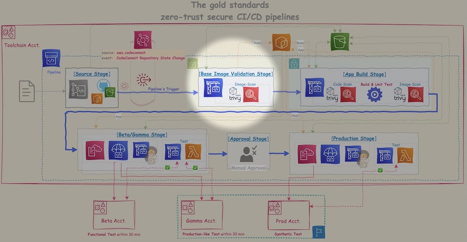

# 🛠️ Runbook: Base Image Validation Stage (Zero-Trust CI/CD)

<br>

||
|---|
||

---

<br>

## 🪩 Purpose

<br>

><mark>**Always scan before use, even vender verified images**</mark>

Ensure that base container images (e.g., `caddy:2.7.6`) are **free from critical vulnerabilities** before being used as build foundations.  
This enforces a <mark>**shift-left security model**</mark> and prevents unsafe dependencies from reaching production stages.

---

<br>

- [🛠️ Runbook: Base Image Validation Stage (Zero-Trust CI/CD)](#️-runbook-base-image-validation-stage-zero-trust-cicd)
  - [🪩 Purpose](#-purpose)
    - [0️⃣ Prerequisites](#0️⃣-prerequisites)
      - [✰ Trivy Image Pull \& Push it to the 🟠ECR](#-trivy-image-pull--push-it-to-the-ecr)
    - [1️⃣ Variables to Set](#1️⃣-variables-to-set)
    - [2️⃣ Trivy and Base Image Pull](#2️⃣-trivy-and-base-image-pull)
    - [3️⃣ 🛡Base Image Vulnerability Scan and Upload Scan results for Manual Approval](#3️⃣-base-image-vulnerability-scan-and-upload-scan-results-for-manual-approval)
    - [⚠️ \[REQUIRED\] Approval checkpoint: Review scan results before pushing image.](#️-required-approval-checkpoint-review-scan-results-before-pushing-image)
    - [4️⃣ 🛡Generate and Upload SBOM (CycloneDX Format)](#4️⃣-generate-and-upload-sbom-cyclonedx-format)
    - [5️⃣ Push Secure Base Image to 🟠ECR](#5️⃣-push-secure-base-image-to-ecr)

---

<br>

### 0️⃣ Prerequisites

<br>

* ✅ Docker installed (with BuildKit & volume support)
* ✅ IAM credentials configured for AWS CLI
* ✅ A secure 🟢**S3 bucket** to archive vulnerability reports

- **🟠ECR repository structure is aligned**

>```bash
>Repository Name: debut/tools/trivy          # Trivy scanner image (ex: 0.62.1)
>Repository Name: debut/base-images/caddy    # Verified base images (e.g., caddy, golang)
>Repository Name: debut/pre-baked/caddy-tls  # (Option) Verified pre-baked images (from base images)
>Repository Name: debut/apps/caddy-tls       # Application-specific container images
>Repository Name: debut/apps/cert-injector   # Application-specific container images
>```

---

<br>

#### ✰ Trivy Image Pull & Push it to the 🟠ECR

<br>

📌 e.g., <mark>**On 🔵CloudShell**</mark> (AWS managed network)

- 🐾 A. 🚨**Define variables**

```bash-session
# export AWS_REGION="us-west-2"
# ACCOUNT_ID=`\aws sts get-caller-identity | jq -r .Account`

# SCAN_TOOL_REPO_NAME=debut/tools/trivy ; echo ${SCAN_TOOL_REPO_NAME}
# REPOSITORY="${ACCOUNT_ID}.dkr.ecr.${AWS_DEFAULT_REGION}.amazonaws.com" ; echo ${REPOSITORY}
```

<br>

- 🐾 B. **Get latest trivy**

```bash-session
# docker pull aquasec/trivy:latest
# VERSION=`docker inspect aquasec/trivy:latest | jq '.[].Config.Labels."org.opencontainers.image.version"' -r` ; echo ${VERSION:-NULL}
# docker tag aquasec/trivy:latest aquasec/trivy:${VERSION} ; docker images aquasec/trivy:${VERSION}

### For 🟠ECR
# SCAN_TOOL_IMAGE="${REPOSITORY}/${SCAN_TOOL_REPO_NAME}:${VERSION}" ; echo ${SCAN_TOOL_IMAGE}
# docker tag aquasec/trivy:${VERSION} ${SCAN_TOOL_IMAGE} ; docker images ${SCAN_TOOL_IMAGE}
```

>```console
>latest: Pulling from aquasec/trivy
>f18232174bc9: Pull complete 
>ef7034495152: Pull complete 
>9cdae7569ace: Pull complete 
>21038c1e39ac: Pull complete 
>Digest: sha256:fc10faf341a1d8fa8256c5ff1a6662ef74dd38b65034c8ce42346cf958a02d5d
>Status: Downloaded newer image for aquasec/trivy:latest
>docker.io/aquasec/trivy:latest
>
>
>0.62.1
>
>
>REPOSITORY      TAG       IMAGE ID       CREATED       SIZE
>aquasec/trivy   0.62.1    89d1574daaaa   3 weeks ago   174MB
>
>
>REPOSITORY                                                       TAG       IMAGE ID       CREATED       SIZE
>041920240204.dkr.ecr.us-west-2.amazonaws.com/debut/tools/trivy   0.62.1    89d1574daaaa   3 weeks ago   174MB
>```

<br>

- 🐾 C. **Push utility images (trivy) to the 🟠ECR**

```bash-session
# \aws ecr get-login-password --region ${AWS_REGION} | docker login --username AWS --password-stdin "${REPOSITORY%/*}"
# docker push ${SCAN_TOOL_IMAGE}


### Check the result and logout from 🟠ECR
# pwsh -C "aws ecr list-images --repository-name ${SCAN_TOOL_REPO_NAME} | ConvertFrom-Json | select -ExpandProperty imageIds"
# docker logout "${ACCOUNT_ID}.dkr.ecr.${AWS_REGION}.amazonaws.com"
```

<details>

<summary>📖An example of output</summary>

>```console
>WARNING! Your password will be stored unencrypted in /home/cloudshell-user/.docker/config.json.
>Configure a credential helper to remove this warning. See
>https://docs.docker.com/engine/reference/commandline/login/#credentials-store
>Login Succeeded
>
>
>The push refers to repository [041920240204.dkr.ecr.us-west-2.amazonaws.com/debut/tools/trivy]
>4d105ff4f073: Pushed 
>888ba1638e30: Pushed 
>fe52c5417420: Pushed 
>08000c18d16d: Pushed 
>v0.61.0: digest: sha256:bb08683ae1f9d30360070dafdf59bf280a88660d6916887aa0c9a8d8c733b4aa size: 1159
>
>
>
>imageDigest                                                             imageTag
>-----------                                                             --------
>sha256:26ba3721f914f1b49ca6cfa81271b6d78a9b82ad10f5c17a6ecff64555fad2a7 0.62.1
>
>
>Removing login credentials for 041920240204.dkr.ecr.us-west-2.amazonaws.com
>```

</details>

---

<br>

### 1️⃣ Variables to Set

<br>

📌 e.g., <mark>**On 🔵CloudShell**</mark> (AWS managed network)

<br>

```bash-session
### 🚨Define variables
# export AWS_REGION="us-west-2"
# ACCOUNT_ID=`\aws sts get-caller-identity | jq -r .Account`

# APPS_REPO_NAME="debut/apps/caddy" ; SCAN_TOOL_REPO_NAME="debut/tools/trivy" ; BASE_IMG_REPO_NAME="debut/base-images/caddy"
# REPOSITORY="${ACCOUNT_ID}.dkr.ecr.${AWS_DEFAULT_REGION}.amazonaws.com" ; echo ${REPOSITORY}
# SCAN_TOOL_IMAGE="${REPOSITORY}/${SCAN_TOOL_REPO_NAME}:0.62.1" ; echo ${SCAN_TOOL_IMAGE}

# SCANED_REPORT_BUCKET="your-secure-scan-logs"
```

---

<br>

### 2️⃣ Trivy and Base Image Pull

<br>

```bash-session
### Pull Trivy scanner from 🟠ECR
# \aws ecr get-login-password --region ${AWS_REGION} | docker login --username AWS --password-stdin "${REPOSITORY%/*}"
# docker pull ${SCAN_TOOL_IMAGE} ; docker images ${SCAN_TOOL_IMAGE}

### Pull base image (caddy) from Docker Hub
# docker pull caddy:builder
# VERSION=`docker inspect caddy:builder | jq '.[].Config.Env[5]' -r | cut -f2 -d "="` ; echo ${VERSION:-NULL}
# docker tag caddy:builder caddy-builder:${VERSION} ; docker images caddy-builder:${VERSION}

### 🚨Define variables 
# BASE_IMAGE="caddy:${VERSION}"
# SECURE_BASE_IMAGE="${REPOSITORY}/${BASE_IMG_REPO_NAME}:${VERSION}" ; echo ${SECURE_BASE_IMAGE}
```

>```console
>WARNING! Your password will be stored unencrypted in /home/cloudshell-user/.docker/config.json.
>Configure a credential helper to remove this warning. See
>https://docs.docker.com/engine/reference/commandline/login/#credentials-store
>Login Succeeded
>
>
>0.62.1: Pulling from debut/tools/trivy
>Digest: sha256:bb08683ae1f9d30360070dafdf59bf280a88660d6916887aa0c9a8d8c733b4aa
>Status: Image is up to date for 041920240204.dkr.ecr.us-west-2.amazonaws.com/debut/tools/trivy:0.62.1
>041920240204.dkr.ecr.us-west-2.amazonaws.com/debut/tools/trivy:0.62.1
>
>REPOSITORY                                                       TAG       IMAGE ID       CREATED       SIZE
>041920240204.dkr.ecr.us-west-2.amazonaws.com/debut/tools/trivy   0.62.1    89d1574daaaa   3 weeks ago   174MB
>
>
>latest: Pulling from library/caddy
>f18232174bc9: Already exists 
>f5475df3da1b: Pull complete 
>3b0ae3ace4a6: Pull complete 
>eb621c62f244: Pull complete 
>4f4fb700ef54: Pull complete 
>Digest: sha256:30ccf0cb027e1d06cd6e453c04fc1c8eec665629b22ed69602c14c8a0512ead0
>Status: Downloaded newer image for caddy:latest
>docker.io/library/caddy:latest
>
>REPOSITORY   TAG       IMAGE ID       CREATED       SIZE
>caddy        v2.10.0   14300de7e087   5 weeks ago   50.5MBMB
>```

---

<br>

### 3️⃣ 🛡Base Image Vulnerability Scan and Upload Scan results for Manual Approval

<br>

```bash-session
### Run scan
# docker run --rm -v /var/run/docker.sock:/var/run/docker.sock ${SCAN_TOOL_IMAGE} image --exit-code 1 --severity HIGH,CRITICAL ${BASE_IMAGE}


### Create scan results for 🛡Manual Approval (You can send the scan results to the auditor or reviewer.)
# docker run --rm -v /var/run/docker.sock:/var/run/docker.sock -v ./output:/output ${SCAN_TOOL_IMAGE} image --exit-code 1 --severity HIGH,CRITICAL ${BASE_IMAGE} --format json --output /output/scan.results.${BASE_IMAGE//:/_}.json
# pwsh -C "Get-Content ./output/scan.results.${BASE_IMAGE//:/_}.json | ConvertFrom-Json | select -ExpandProperty Results"

### Upload scan results to 🟢S3
# \aws s3 cp ./output/scan.results.${BASE_IMAGE//:/_}.json s3://${SCANED_REPORT_BUCKET}/scan.results.${BASE_IMAGE//:/_}_$(date +%Y%M%S).json
```

- ❌ **Bad result**🫠 (e.g., caddy:2.7.6)

>```console
>2025-05-29T10:55:17Z    INFO    [vulndb] Need to update DB
>2025-05-29T10:55:17Z    INFO    [vulndb] Downloading vulnerability DB...
>2025-05-29T10:55:17Z    INFO    [vulndb] Downloading artifact...        repo="mirror.gcr.io/aquasec/trivy-db:2"
>:
>Report Summary
>
>┌─────────────────────────────┬──────────┬─────────────────┬─────────┐
>│           Target            │   Type   │ Vulnerabilities │ Secrets │
>├─────────────────────────────┼──────────┼─────────────────┼─────────┤
>│ caddy:2.7.6 (alpine 3.18.6) │  alpine  │        0        │    -    │
>├─────────────────────────────┼──────────┼─────────────────┼─────────┤
>│ usr/bin/caddy               │ gobinary │        9        │    -    │
>└─────────────────────────────┴──────────┴─────────────────┴─────────┘
>Legend:
>- '-': Not scanned
>- '0': Clean (no security findings detected)
>
>usr/bin/caddy (gobinary)
>========================
>Total: 9 (HIGH: 7, CRITICAL: 2)
>```

<br>

- ✅ **Good result**🤩 (e.g., caddy:2.10.0)

>```console
>:
>Report Summary
>
>┌───────────────────────────────┬──────────┬─────────────────┬─────────┐
>│            Target             │   Type   │ Vulnerabilities │ Secrets │
>├───────────────────────────────┼──────────┼─────────────────┼─────────┤
>│ caddy:v2.10.0 (alpine 3.21.3) │  alpine  │        0        │    -    │
>├───────────────────────────────┼──────────┼─────────────────┼─────────┤
>│ usr/bin/caddy                 │ gobinary │        0        │    -    │
>└───────────────────────────────┴──────────┴─────────────────┴─────────┘
>Legend:
>- '-': Not scanned
>- '0': Clean (no security findings detected)
>```

>⚠️ If this fails with `exit-code 1`, **stop the pipeline** — the base image is insecure.

---

<br>


### ⚠️ <mark>[REQUIRED] Approval checkpoint</mark>: Review scan results before pushing image.

<br>

---

<br>

### 4️⃣ 🛡Generate and Upload SBOM (CycloneDX Format)

<br>

```bash-session
# docker run --rm -v /var/run/docker.sock:/var/run/docker.sock -v ./output:/output "${SCAN_TOOL_IMAGE}" image --format cyclonedx --output /output/sbom.cdx.${BASE_IMAGE//:/_}.json "${BASE_IMAGE}"

### Upload SBOM to 🟢S3
# \aws s3 cp ./output/sbom.cdx.${BASE_IMAGE//:/_}.json s3://${SCANED_REPORT_BUCKET}/sbom.cdx.${BASE_IMAGE//:/_}_$(date +%Y%M%S).json
```

>```console
>2025-05-29T11:17:31Z    INFO    "--format cyclonedx" disables security scanning. Specify "--scanners vuln" explicitly if you want to include vulnerabilities in the "cyclonedx" report.
>2025-05-29T11:17:32Z    INFO    Detected OS     family="alpine" version="3.21.3"
>2025-05-29T11:17:32Z    INFO    Number of language-specific files       num=1
>```

- (Optional) Take a look at SBOM:

```bash-session
# pwsh -C 'Get-Content ./output/sbom.baseimage.cdx.json | ConvertFrom-Json | fl $_'
```

<details>

<summary>📖An example of output</summary>

>```ps1
>$schema         : http://cyclonedx.org/schema/bom-1.6.schema.json
>bomFormat       : CycloneDX
>specVersion     : 1.6
>serialNumber    : urn:uuid:cdb19fac-51a2-482d-83ad-ce1fb4cafc2f
>version         : 1
>metadata        : @{timestamp=5/29/2025 11:17:32 AM; tools=; component=}
>components      : {@{bom-ref=9368ae31-66ac-4b58-9325-5e518af03729; type=application; name=usr/bin/caddy; properties=System.Object[]}, 
>                  @{bom-ref=fe104365-b63b-47f7-8a10-696bceaff17c; type=operating-system; name=alpine; version=3.21.3; properties=System.Object[]}, 
>                  @{bom-ref=pkg:apk/alpine/alpine-baselayout-data@3.6.8-r1?arch=x86_64&distro=3.21.3; type=library; name=alpine-baselayout-data; 
>                  version=3.6.8-r1; hashes=System.Object[]; licenses=System.Object[]; 
>                  purl=pkg:apk/alpine/alpine-baselayout-data@3.6.8-r1?arch=x86_64&distro=3.21.3; properties=System.Object[]}, 
>                  @{bom-ref=pkg:apk/alpine/alpine-baselayout@3.6.8-r1?arch=x86_64&distro=3.21.3; type=library; name=alpine-baselayout; version=3.6.8-r1; 
>                  hashes=System.Object[]; licenses=System.Object[]; purl=pkg:apk/alpine/alpine-baselayout@3.6.8-r1?arch=x86_64&distro=3.21.3; 
>                  properties=System.Object[]}…}
>dependencies    : {@{ref=9368ae31-66ac-4b58-9325-5e518af03729; dependsOn=System.Object[]}, @{ref=fe104365-b63b-47f7-8a10-696bceaff17c; 
>                  dependsOn=System.Object[]}, @{ref=pkg:apk/alpine/alpine-baselayout-data@3.6.8-r1?arch=x86_64&distro=3.21.3; dependsOn=System.Object>[]}, 
>                  @{ref=pkg:apk/alpine/alpine-baselayout@3.6.8-r1?arch=x86_64&distro=3.21.3; dependsOn=System.Object[]}…}
>vulnerabilities : {}
>```

</details>

---

<br>

### 5️⃣ Push Secure Base Image to 🟠ECR

<br>

```bash-session
### Tag and push the base image to your own private 🟠ECR repo
# docker tag "${BASE_IMAGE}" "${SECURE_BASE_IMAGE}"
# \aws ecr get-login-password --region $AWS_REGION | docker login --username AWS --password-stdin "${ACCOUNT_ID}.dkr.ecr.${AWS_REGION}.amazonaws.com"
# docker push "${SECURE_BASE_IMAGE}"


### Check the result and logout from 🟠ECR
# pwsh -C "aws ecr list-images --repository-name ${BASE_IMG_REPO_NAME} | ConvertFrom-Json | select -ExpandProperty imageIds"
# docker logout "${ACCOUNT_ID}.dkr.ecr.${AWS_REGION}.amazonaws.com"
```

>```console
>imageDigest                                                             imageTag
>-----------                                                             --------
>sha256:3463e0c8fd5e77022a0d591397eaca628f7352b78068bfd5fe0c2a0c4a8952e2 v2.10.0
>```

---