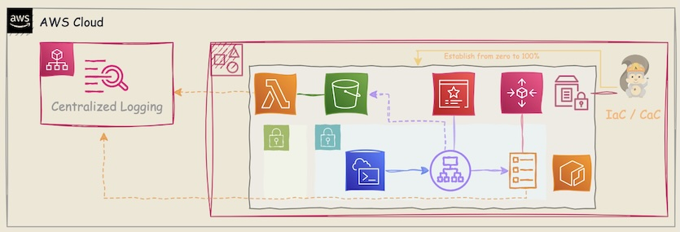

# Cloud-Native Application architecture: Fargate Cluster

<br>

This repository provides a <mark>**Cloud-Native Application Architecture**</mark> using AWS Serverless Application Model (🟠**SAM**).  
It leverages 🟠**AWS Fargate** to run containers in a `cost-effective`, `reliable`, and `scalable` manner, eliminating the need for server management.

The architecture follows a `SEC01-BP06`: <mark>**Immutable Infrastructure**</mark> approach with Infrastructure as Code (**`IaC`**) and Configuration as Code (**`CaC`**), ensuring consistency and repeatability in deployments.  
It adopts a **modular strategy**, allowing `flexible deployment` and management of individual components while adhering to the <mark>**AWS Well-Architected Framework**</mark> **best practices**.🫶🏻 [^1]

This solution is designed to support **education and testing environments**, providing a structured, scalable, and automated infrastructure-as-code setup.

---

<br>

## 🪩 Table of Contents

<br>

- [Cloud-Native Application architecture: Fargate Cluster](#cloud-native-application-architecture-fargate-cluster)
  - [🪩 Table of Contents](#-table-of-contents)
  - [🪩 Architecture Overview](#-architecture-overview)
    - [☻ Deployment Order](#-deployment-order)
  - [🪩 Deployment Steps](#-deployment-steps)
    - [☻ Requirements](#-requirements)
      - [✰ Python modules](#-python-modules)
      - [✰ AWS PoLP Permissions](#-aws-polp-permissions)
    - [0️⃣ Create a Virtual Environment (Recommended)](#0️⃣-create-a-virtual-environment-recommended)
    - [1️⃣ 🔴ACM - Upload SSL/TLS Certificates](#1️⃣-acm---upload-ssltls-certificates)
    - [2️⃣ Deploy 🟣VPC](#2️⃣-deploy-vpc)
      - [✰ Basic VPC Setup](#-basic-vpc-setup)
        - [✦ 🔴SSM ParameterStore settings](#-ssm-parameterstore-settings)
      - [✰ 🟣VPC-Extras💰](#-vpc-extras)
    - [3️⃣ Deploy 🟠Lambda for ALB Logs Forwarding \& 🟢S3](#3️⃣-deploy-lambda-for-alb-logs-forwarding--s3)
    - [4️⃣ Deploy Internal 🔴ALB💰](#4️⃣-deploy-internal-alb)
    - [5️⃣ Deploy 🟠ECR \& 🟠ECS Fargate Cluster💰](#5️⃣-deploy-ecr--ecs-fargate-cluster)
    - [6️⃣ Deploy 🔴Application Auto Scaling](#6️⃣-deploy-application-auto-scaling)
    - [☻ Test the Connection](#-test-the-connection)
    - [🚮 Clean it up](#-clean-it-up)
      - [✰ (Option) Check Actual Costs🫣](#-option-check-actual-costs)

---

<br>

## 🪩 Architecture Overview

<br>

The deployment is structured into **multiple modular 🟠SAM templates**, each responsible for a specific part of the infrastructure.  
The stack includes:

- 🟣**Networking** (VPC, Subnets, Internet/NAT Gateway, VPC Endpoints(Gen.1 and 2))
- 🔴**SSM Parameter Store** for configuration management
- 🟠**Fargate cluster** and 🔴**Application Auto Scaling** for serverless container workloads
- 🔴**Application Load Balancer** (ALB) for routing traffic
- 🔴**AWS Certificate Manager** (ACM) for provide End-to-End encrypt transit 
- **Observability and logging**(ALBLogs-Forwarder(🟠**Lambda**, 🟢**S3**))  

|High-level overview|
|---|
||

|Overview|
|---|
||

---

<br>

### ☻ Deployment Order

<br>

- To ensure dependencies are met, deploy the stacks in the following order:

| yaml | purpose |
|---|---|
| 1. VPC.yaml | Creates the VPC, subnets, and routing. |
| 2. SSM.yaml | Stores important parameters (e.g., VPC ID, ALB settings) in SSM Parameter Store. |
| 3. VPC_Extras_Gen2Endpoint.yaml | Adds additional networking resources like NAT Gateway and VPC Endpoints. |
| 4. VPC_Extras_Flowlogs.yaml | Enables VPC Flow Logs for monitoring network traffic. |
| 5. ALB_Logs_Forwarder.yaml | Sets up forwarding of ALB access logs to S3 or another logging solution. |
| 6. ALB_Internal.yaml | Deploys the internal ALB for routing requests within the VPC. |
| 7. FargateCluster.yaml | Provisions the ECS Fargate cluster for running serverless containerized applications. |
| 8. AppAutoScaling.yaml | Configures application auto-scaling policies for Fargate tasks. |

---

<br>

## 🪩 Deployment Steps

<br>

> 💡 **Note:**
> In this case, we’ll deploy the 🟠**Fargate cluster** in <mark>**us-west-2 (Oregon)**</mark>.

---

<br>

### ☻ Requirements

<br>

---

<br>

#### ✰ Python modules

<br>

- Python 3.12+
- Boto3

---

<br>

#### ✰ AWS PoLP Permissions

<details>

<summary>📖Principle of Least Privilege (PoLP) Policy</summary>

| Target Services | Minimum permissions | 
|---|---|
| 🔴**Application AutoScaling** | application-autoscaling:RegisterScalableTarget |
| | application-autoscaling:PutScalingPolicy |
| | application-autoscaling:DeregisterScalableTarget |
| | autoscaling-plans:CreateScalingPlan |
| | autoscaling-plans:UpdateScalingPlan |
| | autoscaling-plans:DeleteScalingPlan |
| 🔴**CloudFormation** | cloudformation:CreateStack |
| | cloudformation:UpdateStack |
| | cloudformation:DescribeStacks |
| | cloudformation:DeleteStack |
| 🔴**CloudWatch** | cloudwatch:PutMetricData |
| | cloudwatch:GetMetricData |
| | cloudwatch:GetMetricStatistics |
| | cloudwatch:DescribeAlarms |
| 🟠**EC2** | ec2:Describe* |
| | ec2:AuthorizeSecurityGroup* |
| | ec2:CreateSecurityGroup |
| | ec2:DeleteSecurityGroup |
| | ec2:CreateRoute* |
| | ec2:ReplaceRoute* |
| | ec2:AssociateRouteTable |
| | ec2:CreateTags |
| | ec2:AcceptVpcEndpointConnections |
| | ec2:CreateNetworkInterface* |
| | ec2:DeleteRoute* |
| | ec2:DeleteNetworkInterface* |
| | ec2:CreateVpcEndpoint* |
| | ec2:ModifyVpcEndpoint* |
| | ec2:DeleteVpcEndpoint* |
| 🟠**ECR** | ecr:GetAuthorizationToken |
| | ecr:BatchCheckLayerAvailability |
| | ecr:GetDownloadUrlForLayer |
| | ecr:BatchGetImage |
| 🟠**ECS** | ecs:CreateCluster |
| | ecs:CreateService |
| | ecs:DeleteService |
| | ecs:Describe* |
| | ecs:RegisterTaskDefinition |
| | ecs:RunTask |
| | ecs:StopTask |
| | ecs:UpdateService |
| 🟠**ALB** | elasticloadbalancing:CreateListener |
| | elasticloadbalancing:CreateLoadBalancer |
| | elasticloadbalancing:CreateTargetGroup |
| | elasticloadbalancing:Delete* |
| | elasticloadbalancing:DeregisterTargets |
| | elasticloadbalancing:Describe* |
| | elasticloadbalancing:RegisterTargets |
| 🟠**Lambda** | lambda:CreateFunction |
| | lambda:InvokeFunction |
| | lambda:UpdateFunctionConfiguration |
| | lambda:UpdateFunctionCode |
| | lambda:DeleteFunction |
| 🔴**CloudWatch Logs** | logs:Create* |
| | logs:Describe* |
| | logs:FilterLogEvents |
| | logs:Get* |
| | logs:List* |
| | logs:PutLogEvents |
| | logs:StartQuery |
| | logs:StopQuery |
| | logs:TagLogGroup |
| 🟢**S3** | s3-object-lambda:* |
| | s3:GetObject |
| | s3:PutObject |
| | s3:ListBucket |
| | s3:DeleteObject |
| | s3:GetBucketLocation |
| 🔴**SSM** | ssm:DescribeDocument |
| | ssm:GetAutomationExecution |
| | ssm:ListDocuments |
| | ssm:StartAutomationExecution |
| | tag:GetResources |
| 🔴**IAM** | iam:Generate* |
| | iam:Get* |
| | iam:List* |
| | iam:PassRole |
| | iam:Update* |
| | iam:Delete* |
| | iam:Upload* |
| | iam:CreateRole |
| | iam:CreatePolicy* |
| | iam:CreateServiceSpecificCredential |
| | iam:CreateServiceLinkedRole |
| | iam:Attach* |
| | iam:Put* |

</details>

---

<br>

### 0️⃣ Create a Virtual Environment (Recommended)

<br>

Before deploying AWS services, it’s **highly recommended** to create a **virtual environment**. This isolates dependencies required for this project from your **global Python environment**, preventing conflicts and keeping things clean.

<br>

📌 Clone the Repository & Set Up the Virtual Environment (**Using `venv` (Python 3.3+)**)

1. 🐾 **Navigate to your working directory & clone the repository:**

```bash session
# cd /path/to/your/project
# git clone https://github.com/Hideki-Morita/aws-serverless-education.git
# cd Serverless_Architecture/FargateCluster
```

- Create a virtual environment:

```bash session
# python3 -m venv awsvenv
```

2. 🐾 **Activate the virtual environment:**

  - 🐧 On macOS/Linux:

  ```bash session
  # source awsvenv/bin/activate
  ```

  - 🪟 On Windows:

  ```ps1
  PS1> awsvenv\Scripts\activate
  ```

<br>

Once the virtual environment is activated, install the package using `pip`:
✅ Once activated, your terminal will show something like this:

```console
(awsvenv) user@hostname:~/aws-serverless-education/Serverless_Architecture/FargateCluster$ 
```

<br>

3. 🐾 **Install Required Dependencies:**

- With the virtual environment activated, install the required Python libraries for the 🟠**Lambda function**:

```bash-session
# pip install -r requirements.txt
```

<details>

<summary>📖An example of output</summary>

</details>

<br>

4. 🐾 **Verify Installation:**

- (Optional) Check installed packages:

```bash-session
# pip list
```

✅ You should see `boto3`, `aws-lambda-powertools`, and `aws-xray-sdk` in the output.

---

<br>

### 1️⃣ 🔴ACM - Upload SSL/TLS Certificates

<br>

> 💡 **Note:**
> 🙃 The `schema` ensures binary-safe file uploads (`fileb://`)

- 📌 Example Files:
  - **Root Certificate**: <i>certificate.crt</i>  
  - **Child Certificate**: <i>child_certificate.crt</i>  
  - **Child Private Key**: <i>child_private_key.pem</i>  

<details>

<summary>📖Summary of Certificates</summary>

- **Key algorithm**
  - **EC** with **P-256 curve**

- **certificate.crt (Root Certificate)**
  - issuer=CN=mastermind.swiftie.com
  - subject=CN=mastermind.swiftie.com
  - notBefore=Feb 15 10:52:02 2025 GMT
  - notAfter=Feb 28 10:52:02 2029 GMT

- **child_certificate.crt (Child Certificate)**
  - issuer=CN=mastermind.swiftie.com
  - subject=CN=*.swiftie.com
  - notBefore=Feb 15 11:15:00 2025 GMT
  - notAfter=Feb 14 11:15:00 2029 GMT
  - X509v3 Subject Alternative Name: 
  -     DNS:*.swiftie.com, DNS:Betty.swiftie.com, DNS:James.swiftie.com, DNS:Inez.swiftie.com, DNS:swiftie.com

</details>

- Upload self-certificate to 🔴**ACM**

```bash-session
# export AWS_DEFAULT_REGION=us-west-2
# aws acm import-certificate --certificate fileb://CAs/child_certificate.crt --private-key fileb://CAs/child_private_key.pem --certificate-chain fileb://CAs/certificate.crt
```

- (Option) Verify the uploaded certificate

```bash-session
# aws acm list-certificates --includes 'keyTypes=[EC_prime256v1]'
```

---

<br>

### 2️⃣ Deploy 🟣VPC

<br>

---

<br>

#### ✰ Basic VPC Setup

<br>

This template creates a **basic 🟣VPC** with:
  - Public and private **subnets**
  - An **Internet Gateway**
  - **Routing tables**
  - **Network ACLs** for security

<br>

- 📌 Required Parameters:
  - **`AvailabilityZones`**: <i>us-west-2a,us-west-2b,us-west-2c, us-west-2d</i> (Oregon) *You can adjust this however you like.
  - **`VPCName`**: <i>TestVPC</i>

<details>

<summary>📖Resulting Architecture</summary>

>```console
>### You will deploy something like this,
>└── VPC (CIDR: 10.0.0.0/16, DNS Support & Hostnames enabled)
>    ├── InternetGateway
>    │   └── VPCGatewayAttachment -> ../../VPC
>    ├── NetworkAcl-Private
>    │   ├── NetworkAclEntry
>    │   └── SubnetNetworkAclAssociation -> ../Subnet-Private
>    ├── NetworkAcl-Public
>    │   ├── NetworkAclEntry
>    │   └── SubnetNetworkAclAssociation -> ../Subnet-Public
>    ├── RouteTable-Public
>    │   ├── Route -> ../InternetGateway
>    │   └── SubnetRouteTableAssociation -> ../Subnet-Public
>    ├── Subnet-Private (CIDR: 10.0.3.0/24|10.0.4.0/24)
>    └── Subnet-Public  (CIDR: 10.0.1.0/24|10.0.2.0/24 Public IP enabled)
>```

</details>

- `--config-env` (Environment name): <i>Basic-VPC</i>

```bash-session
### The first time
# sam deploy --guided -t VPC.yaml

  ### After the second
  # sam deploy -t VPC.yaml --config-env Basic-VPC
```

---

<br>

##### ✦ 🔴SSM ParameterStore settings

<br>

This template stores critical infrastructure parameters in **AWS Systems Manager** (🔴**SSM**) **Parameter Store**, allowing easy access for other components for avoiding hardcoded values.

> 💡 **Note:**
> Three Approaches for getting values.

- Comparison of Methods:

||Single Stack|Cross-Stack Exports/Imports|🔴**SSM Parameter Store**|
|---|---|---|---|
| When to Use     | Small projects | Separate but coupled stacks |Most dynamic setup (change values without redeploy)|
| Flexibility     | ❌ Low|✅ Medium|🫶🏻High✨|
| Complexity      | ✅ Simple|❌ Somewhat Complex|Easy|
| **When to Use** | Basic Environments|Microservices|Microservices, Enterprise & Multi-Region|

- 📌 Required Parameters:
  - `ACMCertificateArn` : <i>arn:aws:acm:us-west-2:<ACCOUNT-ID>:certificate/xxxx</i>
  - `VPCID` : <i>vpc-xxxx</i>
  - `PrivateSubnet1` : <i>subnet-xxxa</i>
  - `PrivateSubnet2` : <i>subnet-xxxb</i>
  - `PublicSubnet1` : <i>subnet-xxxc</i>
  - `PublicSubnet2` : <i>subnet-xxxd</i>
  - `NatGatewayID` : **Unknown** (Update later)
  - `ALBSecurityGroupName` : **Unknown** (Update later)
  - `ALBTargetGroupARN` : **Unknown** (Update later)
  - `ALBName` : <i>TSALB</i>
  - `ALBS3BucketName` : <i>alb-logs-2v9dr-u4aod-vxq6f-a5ow3-thgir-syawla-tfiws-rolyat</i>
  - `ALBPrefix` : <i>alb-access-logs</i>
  - `ECSClusterName` : <i>TSCluster</i>
  - `ECSServiceName` : <i>TSService</i>
  - `ECSTaskDefinitionName`: <i>TS-11</i>
  - `ECSContainerName`: <i>TTPD-nginx</i>

- [💡Tips: **General purpose 🟢S3 bucket naming rules**](https://docs.aws.amazon.com/AmazonS3/latest/userguide/bucketnamingrules.html#create-bucket-name-guid) 
    - Useful commands for generate globally unique identifiers
      - **`openssl rand -base64 20 | sed -re 's/(.....)/&-/g' -e 's/[/,+,=]/A/g' | awk '{print tolower($0)}'`**
      - **`uuidgen | tr '[:upper:]' '[:lower:]'`**

- `--config-env` (Environment name): <i>SSM</i>

```bash-session
### The first time
# sam deploy --guided -t SSM.yaml

  ### After the second
  # sam deploy -t SSM.yaml --config-env SSM
```

---

<br>

#### ✰ 🟣VPC-Extras💰

<br>

This template adds a 🟣**NAT Gateway**, `security groups`, and optional 🟣**VPC endpoints** for 🟠**ECS services**. It also adds 🟣**VPC Flowlogs**.

> 💡 **Note:**  
> 🙄 Why Do We Need a 🟣**NAT Gateway** for `Private` 🟠**ECS**?  

  >>When an image is pulled using a pull through cache rule for **the first time**, if you've configured Amazon ECR to use an interface VPC endpoint using AWS PrivateLink then <u>**you need to create a public subnet in the same VPC, with a NAT gateway,**</u> and then route all outbound traffic to the internet from their private subnet to the NAT gateway in order for the pull to work. **Subsequent image pulls don't require this.** [^2]

>⚠️ Cost Warning: [^3]  
>🟣**NAT Gateway** and 🟣**VPC Endpoints** incur hourly and data transfer costs. To prevent unexpected charges, delete the stack when not in use.  
>🟣**VPC Flow Logs** incur charges based on the amount of logged data.  

- Necessary parameters
 - `AvailabilityZones`: <i>us-west-2a,us-west-2b,us-west-2c, us-west-2d</i> (In Oregon)
 - `VPCName`: <i>TestVPC</i>

<details>

<summary>📖Resulting Architecture</summary>

>```console
>### You will deploy(✅) something like this,
>├── LogGroup-VPCFlowLogs ✅
>└── VPC (CIDR: 10.0.0.0/16, DNS Support & Hostnames enabled)
>    ├── EIP ✅
>    ├── FlowLog ✅
>    │   ├── LogGroup-VPCFlowLogs -> ../../LogGroup-VPCFlowLogs
>    │   └── Role-VPCFlowLogs -> ../../Role-VPCFlowLogs
>    ├── InternetGateway
>    │   └── VPCGatewayAttachment -> ../../VPC
>    ├── NetworkAcl-Private
>    │   ├── NetworkAclEntry
>    │   └── SubnetNetworkAclAssociation -> ../Subnet-Private
>    ├── NetworkAcl-Public
>    │   ├── NetworkAclEntry
>    │   └── SubnetNetworkAclAssociation -> ../Subnet-Public
>    ├── RouteTable-Private ✅
>    │   ├── Route -> ../Subnet-Public/NatGateway ✅
>    │   └── SubnetRouteTableAssociation -> ../Subnet-Private ✅
>    ├── RouteTable-Public
>    │   ├── Route -> ../InternetGateway
>    │   └── SubnetRouteTableAssociation -> ../Subnet-Public
>    ├── SecurityGroup-Private-General ✅
>    ├── Subnet-Private (CIDR: 10.0.3.0/24|10.0.4.0/24)
>    │   ├── VPCEndpoint-ECR-API -> ../../SecurityGroup-Private-VPCEndpoints ✅
>    │   ├── VPCEndpoint-ECR-CWLogs -> ../../SecurityGroup-Private-VPCEndpoints ✅
>    │   ├── VPCEndpoint-ECR-DKR -> ../../SecurityGroup-Private-VPCEndpoints ✅
>    │   └── VPCEndpoint-S3 ✅
>    └── Subnet-Public  (CIDR: 10.0.1.0/24|10.0.2.0/24 Public IP enabled)
>        └── NatGateway -> ../EIP ✅
>```

</details>

- `--config-env` (Environment name): <i>VPC-Extras-Gen2Endpoint</i> / <i>VPC-Extras-Flowlogs</i>

```bash-session
### The first time
# sam deploy --guided -t VPC_Extras_Gen2Endpoint.yaml

  ### After the second
  # sam deploy -t VPC_Extras_Gen2Endpoint.yaml --config-env VPC-Extras-Gen2Endpoint


### The first time
# sam deploy --guided -t VPC_Extras_Flowlogs.yaml

  ### After the second
  # sam deploy -t VPC_Extras_Flowlogs.yaml --config-env VPC-Extras-Flowlogs
```

---

<br>

### 3️⃣ Deploy 🟠Lambda for ALB Logs Forwarding & 🟢S3

<br>

This step sets up ALB logs forwarding to CloudWatch Logs

<details>

<summary>📖Resulting Architecture</summary>

>```console
>### You will deploy something like this,
>├── Lambda
>│   └── Function
>│       ├── LogGroup-ALB -> ../../LogGroup-ALB
>│       └── LogGroup-Lambda -> ../../LogGroup-Lambda
>├── LogGroup-ALB
>├── LogGroup-Lambda
>├── Role-ECSTask
>├── S3-ALB
>│   └── S3Trigger -> ../Lambda
>```

</details>

- `--config-env` (Environment name): <i>ALBLogsForwarder</i>

```bash-session
### Build
# sam build -t ALB_Logs_Forwarder.yaml

### The first time
# sam deploy --guided -t ALB_Logs_Forwarder.yaml

  ### After the second
  # sam deploy -t ALB_Logs_Forwarder.yaml --config-env ALBLogsForwarder
```

---

<br>

### 4️⃣ Deploy Internal 🔴ALB💰

<br>

>⚠️ Cost Warning: [^3]  
>The Application Load Balancer (🔴**ALB**) is a paid service and incurs hourly and LCU-based charges.

<details>

<summary>📖Resulting Architecture</summary>

>```console
>### You will deploy something like this,
>└── VPC
>    ├── SecurityGroup-Private-ALB -> SecurityGroup-Private-HTTPS
>    ├── SecurityGroup-Private-HTTPS
>    ├── SecurityGroup-Private-VPCEndpoints
>    ├── Subnet-Private
>    │   ├── LoadBalancer
>    │   │   ├── Listener -> ../../../ACM-ALB
>    │   │   ├── S3-ALB -> ../../../S3-ALB
>    │   │   ├── SecurityGroup-Private-ALB -> ../../SecurityGroup-Private-ALB
>    │   │   └── TargetGroup
>```

</details>

- `--config-env` (Environment name): <i>ALB-Internal</i>

```bash-session
### The first time
# sam deploy --guided -t ALB_Internal.yaml

  ### After the second
  # sam deploy -t ALB_Internal.yaml --config-env ALB-Internal
```

---

<br>

### 5️⃣ Deploy 🟠ECR & 🟠ECS Fargate Cluster💰

<br>

<details>

<summary>📖Resulting Architecture</summary>

>```console
>### You will deploy something like this,
>├── ECS-Cluster
>├── LogGroup-ECS
>├── Role-ECSTask
>└── VPC
>    ├── SecurityGroup-Private-Fargate -> SecurityGroup-Private-ALB
>    ├── Subnet-Private
>    │   ├── ECS-Service
>    │   │   ├── ECS-Cluster -> ../../../ECS-Cluster
>    │   │   ├── SecurityGroup-Private-Fargate -> ../../SecurityGroup-Private-Fargate
>    │   │   └── TaskDefinition
>    │   │       ├── LogGroup-ECS -> ../../../../LogGroup-ECS
>    │   │       └── Role-ECSTask -> ../../../../Role-ECSTask
>```

</details>

📌 <mark>**On 🔵CloudShell in `Private` Subnet**</mark>

```bash-session
### Define variables
# REPO_NAME=debut ; ACCOUNT_ID=`aws sts get-caller-identity | jq -r .Account`

### Create ECR Private Repo for Your Custom Images
# aws ecr create-repository --repository-name ${REPO_NAME:-NULL}

### Pull Nginx from AWS Public ECR (Preferred)
# docker pull --platform=linux/arm64 public.ecr.aws/nginx/nginx:latest

  ### (Option) Check if the image architecture and is available
  # docker inspect --format '{{.Architecture}}' public.ecr.aws/nginx/nginx:latest
  # docker images
```

<br>

```bash-session
### Login to ECR
# aws ecr get-login-password --region us-west-2 | docker login --username AWS --password-stdin ${ACCOUNT_ID}.dkr.ecr.us-west-2.amazonaws.com

### Tag the Image for AWS ECR
# docker tag public.ecr.aws/nginx/nginx:latest ${ACCOUNT_ID}.dkr.ecr.us-west-2.amazonaws.com/${REPO_NAME}:latest

### Push Image to AWS ECR
# docker push ${ACCOUNT_ID:-NULL}.dkr.ecr.us-west-2.amazonaws.com/${REPO_NAME:-NULL}:latest

  ### Option: if you want to update current ECS Cluster, then
  # aws ecs update-service --cluster TestCluster --service ECSService --force-new-deployment

### Logout from AWS ECR
# docker logout ${ACCOUNT_ID}.dkr.ecr.us-west-2.amazonaws.com
```

  ---

>⚠️ Cost Warning: [^3]  
>The 🟠**Fargate** is a paid service and incurs hourly and vCPU and storage based charges.

- 📌Deploy Fargate Cluster

- `--config-env` (Environment name): <i>FargateCluster</i>

```bash-session
### The first time
# sam deploy --guided -t FargateCluster.yaml

  ### After the second
  # sam deploy -t FargateCluster.yaml --config-env FargateCluster
```

---

<br>

### 6️⃣ Deploy 🔴Application Auto Scaling

<br>

<details>

<summary>📖Resulting Architecture</summary>

>```console
>### You will deploy something like this,
>├── ApplicationAutoScaling
>│   ├── ScalableTarget
>│   │   ├── ECS-Service -> ../../VPC/Subnet-Private/ECS-Service
>│   │   └── Role-AutoScaling -> ../../Role-AutoScaling
>│   └── ScalingPolicy -> ScalableTarget
>├── Role-AutoScaling
>```

</details>

- `--config-env` (Environment name): <i>ECSAppAutoScaling</i>

```bash-session
### The first time
# sam deploy --guided -t AppAutoScaling.yaml

  ### After the second
  # sam deploy -t AppAutoScaling.yaml --config-env ECSAppAutoScaling
```

---

<br>

### ☻ Test the Connection

<br>

📌 <mark>**On 🔵CloudShell in `Private` Subnet**</mark>

```bash-session
### Upload Root certificate
# cat > certificate.crt
Ctrl+D

# ALB_DNS=TestALB-545957675.us-west-2.elb.amazonaws.com
# curl -vk --cacert certificate.crt https://${ALB_DNS:-NULL} -H "Host: karen.disney.com"
# curl -vk --cacert certificate.crt https://${ALB_DNS:-NULL} -H "Host: dorry.disney.com"
```

- Copy and paste this to send a request

```console
GET / HTTP/1.1
Host: karen.disney.com
Connection: close
```

---

<br>

### 🚮 Clean it up

<br>

```bash-session
### 🔴Application Auto Scaling
# sam delete --config-env ECSAppAutoScaling

### 🟠FargateCluster💰 and 🟠ECR
# sam delete --config-env FargateCluster
# aws ecr delete-repository --repository-name debut

### 🔴ALB💰
# sam delete --config-env ALB-Internal

### 🟠Lambda and 🟢S3
# PRAM_NAME=/FargateCluster/ALB/S3BucketName
# S3_BUCKET_NAME=`aws ssm get-parameter --name ${PRAM_NAME:-NULL} | jq -r '.Parameter.Value'`
# aws s3 rb s3://${S3_BUCKET_NAME:-NULL} --force
# sam delete --config-env ALBLogsForwarder

### 🟣VPC-Extras💰
# sam delete --config-env VPC-Extras-Gen2Endpoint
# sam delete --config-env VPC-Extras-Flowlogs

### 🟣VPC
# sam delete --config-env Basic-VPC
```

---

<br>

#### ✰ (Option) Check Actual Costs🫣

<br>

- $START_DATE: <i>2025-01-18</i>
- $END_DATE: <i>2025-01-19</i>

```bash-session
# START_DATE=`date -u -v-1d +%Y-%m-%d` ; END_DATE=`date -u +%Y-%m-%d` ; echo ${START_DATE} "-" ${END_DATE}
# aws ce get-cost-and-usage --time-period Start=${START_DATE:-NULL},End=${END_DATE:-NULL} --granularity DAILY --metrics UnblendedCost
```

>```console {hl_lines=[12]}
>2025-01-18 - 2025-01-19
>
>{
>   "ResultsByTime": [
>       {
>           "TimePeriod": {
>               "Start": "2025-01-18",
>               "End": "2025-01-19"
>           },
>           "Total": {
>               "UnblendedCost": {
>                   "Amount": "0.698262188",
>                   "Unit": "USD"
>               }
>           },
>           "Groups": [],
>           "Estimated": true
>       }
>   ],
>   "DimensionValueAttributes": []
>}
>```

---

---

<br>

> 💡 **Note:**

[^1]: The Security piller of AWS Well-Architected Framework
- AWS Cloud Foundations
  - [**SEC01-BP01**: Separate workloads using accounts](https://docs.aws.amazon.com/wellarchitected/latest/framework/sec_securely_operate_multi_accounts.html)
    - 
    - [**Establishing your best practice AWS environment**](https://aws.amazon.com/organizations/getting-started/best-practices/)
  - [**SEC04-BP01**: Configure service and application logging](https://docs.aws.amazon.com/wellarchitected/latest/framework/sec_detect_investigate_events_app_service_logging.html)
    - [**CloudWatch cross-account observability**](https://docs.aws.amazon.com/AmazonCloudWatch/latest/monitoring/CloudWatch-Unified-Cross-Account.html)
    - [**Guidance for Observability on AWS**](https://aws.amazon.com/solutions/guidance/observability-on-aws/)
      - [PDF](https://d1.awsstatic.com/solutions/guidance/architecture-diagrams/observability-on-aws.pdf)
- Security foundations
  - [**SEC01-BP06**: Automate deployment of standard security controls](https://docs.aws.amazon.com/wellarchitected/latest/framework/sec_securely_operate_automate_security_controls.html)

[^2]: [**Considerations for Amazon ECR VPC endpoints**](https://docs.aws.amazon.com/AmazonECR/latest/userguide/vpc-endpoints.html#ecr-vpc-endpoint-considerations)

[^3]: - The Pricing list😣 
- [**NAT gateways Pricing**](https://aws.amazon.com/vpc/pricing/)
- [**PrivateLink pricing Pricing**](https://aws.amazon.com/privatelink/pricing/)
- [**Elastic Load Balancing pricing**](https://aws.amazon.com/elasticloadbalancing/pricing/)
- [**VPC Flow Logs Pricing**](https://aws.amazon.com/cloudwatch/pricing/)
- [**AWS Fargate Pricing**](https://aws.amazon.com/fargate/pricing/)

---
