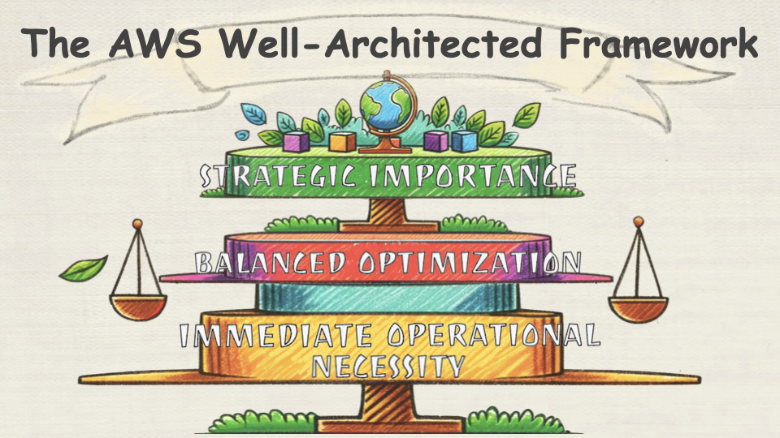

## 🪩 Relationship between SAP Exam and Well-Architected Framework

 

- [AWS-Certified-Solutions-Architect-Professional_Exam-Guide](https://d1.awsstatic.com/training-and-certification/docs-sa-pro/AWS-Certified-Solutions-Architect-Professional_Exam-Guide.pdf)

 

📌 **The Six Pillars Well-Architected Framework**

- **Immediate Operational Necessity** (`SEC` and `OE` are non-negotiable and foundational for immediate operational integrity and excellence.)
  - [Security Pillar](https://docs.aws.amazon.com/pdfs/wellarchitected/latest/security-pillar/wellarchitected-security-pillar.pdf)
  - [Operational Excellence Pillar](https://docs.aws.amazon.com/pdfs/wellarchitected/latest/operational-excellence-pillar/wellarchitected-operational-excellence-pillar.pdf)
- **Balanced Optimization** (`REL`, `PERF`, and `COST` are balanced against each other, often with **trade-offs**, to meet the specific needs and goals of the business.
)
  - [Performance Efficiency Pillar](https://docs.aws.amazon.com/pdfs/wellarchitected/latest/performance-efficiency-pillar/wellarchitected-performance-efficiency-pillar.pdf)
  - [Reliability Pillar](https://docs.aws.amazon.com/pdfs/wellarchitected/latest/reliability-pillar/wellarchitected-reliability-pillar.pdf)
  - [Cost Optimization Pillar](https://docs.aws.amazon.com/pdfs/wellarchitected/latest/cost-optimization-pillar/wellarchitected-cost-optimization-pillar.pdf)
- **Strategic Importance** (**Sustainability** is a strategic imperative that influences long-term planning and reflects a commitment to responsible business practices.
)
  - [Sustainability Pillar](https://docs.aws.amazon.com/pdfs/wellarchitected/latest/sustainability-pillar/wellarchitected-sustainability-pillar.pdf)

 

Here’s the relational list mapping all domains and task statements from the **AWS Certified Solutions Architect Professional** (SAP-C02) Exam Guide to the <mark>**AWS Well-Architected Framework**</mark> principles:

---

 

### ☻ Domain 1: Design Solutions for Organizational Complexity

---

 

#### ✰ Task Statement 1.1: Architect _network connectivity_ strategies.

 

- **`REL02-BP01`**(High👀): Use highly available _network connectivity_ for your workload public endpoints

Skills in:  
- 1. Evaluating connectivity options for **multiple VPCs**  
  - **`REL02-BP03`**: Ensure IP subnet allocation accounts for expansion and availability.  
    - [Building a Scalable and Secure **Multi-VPC** AWS Network Infrastructure](https://docs.aws.amazon.com/pdfs/whitepapers/latest/building-scalable-secure-multi-vpc-network-infrastructure/building-scalable-secure-multi-vpc-network-infrastructure.pdf)
    - [Amazon Virtual Private Cloud Connectivity Options](https://d1.awsstatic.com/whitepapers/aws-amazon-vpc-connectivity-options.pdf)
- 2. Evaluating **connectivity options** for on-premises, co-location, and cloud integration  
  - **`REL02-BP02`**(High👀): Provision redundant **connectivity between** private networks in the cloud and on-premises environments.  
- 3. Selecting AWS Regions and Availability Zones based on **network and latency requirements**
  - **`PERF04-BP06`**: Choose your workload's location based on **network requirements**
    - `REL10-BP01`(High👀): Deploy the workload to multiple locations 
    - `PERF04-BP02`(High👀): Evaluate available networking features 
- 4. Troubleshooting traffic flows by using AWS tools
  - **`PERF04-BP07`**: Optimize network configuration based on metrics 
    - [AWS re:Invent 2020 – Monitoring and troubleshooting network trafic](https://www.youtube.com/watch?v=Ed09ReWRQXc)  
- 5. Using service endpoints for service integrations 
  - **`SEC05-BP01`**(High👀): Create network layers
  - **`SEC05-BP02`**(High👀): Control traffic flow within your network layers.

 

Task Statement 1.2: Prescribe security controls.

Skills in:
	- Designing access control mechanisms
	- SEC01-BP03: Implement least privilege access control for all systems.
	- Protecting data at rest and in transit
	- SEC02-BP04: Use AWS-managed encryption wherever possible.
	- Monitoring and incident response
	- SEC03-BP05: Define and practice incident response procedures.

Task Statement 1.3: Design reliable and resilient architectures.

Skills in:
	- Implementing fault-tolerant systems
	- REL01-BP01: Design for failure by using redundancy and automatic recovery.
	- Applying disaster recovery techniques
	- REL05-BP01: Use a disaster recovery plan with clearly defined recovery objectives.

Task Statement 1.4: Design a multi-account AWS environment.

Skills in:
	- Structuring accounts using AWS Organizations
	- OP04-BP03: Use a multi-account strategy for workload isolation.
	- Centralized governance
	- SEC05-BP02: Aggregate logs across accounts for centralized monitoring.

Task Statement 1.5: Determine cost optimization and visibility strategies.

Skills in:
	- Optimizing resource utilization
	- COST01-BP01: Use Auto Scaling to match capacity to demand.
	- Tracking costs using tags
	- COST02-BP02: Implement cost allocation tags to track resource usage.
	- Leveraging reserved instances
	- COST03-BP03: Use Reserved Instances or Savings Plans for predictable workloads.

Domain 2: Design for New Solutions

Task Statement 2.1: Define secure application architectures.

Skills in:
	- Implementing IAM for secure access
	- SEC01-BP01: Manage application permissions securely using roles and policies.
	- Encrypting data and monitoring access
	- SEC02-BP03: Enable logging for data access monitoring.

Task Statement 2.2: Design high-performance architectures.

Skills in:
	- Optimizing compute resources
	- PERF02-BP01: Choose the optimal compute service for your workload.
	- Implementing efficient data storage
	- PERF03-BP02: Use SSDs or memory-optimized instances where applicable.
	- Improving latency with caching
	- PERF04-BP02: Use caching to improve response times.

Task Statement 2.3: Architect cost-efficient solutions.

Skills in:
	- Selecting storage classes
	- COST01-BP04: Optimize storage by selecting the right class and configuration.
	- Minimizing transfer costs
	- COST02-BP03: Use Amazon CloudFront to reduce data transfer expenses.

Task Statement 2.4: Design sustainable architectures.

Skills in:
	- Reducing energy consumption
	- SUS01-BP02: Use serverless architectures to minimize resource usage.
	- Deploying in renewable energy regions
	- SUS02-BP03: Utilize regions with AWS renewable energy initiatives.

Domain 3: Continuous Improvement for Existing Solutions

Task Statement 3.1: Implement secure and compliant workloads.

Skills in:
	- Automating compliance checks
	- SEC04-BP01: Use AWS Config to automate compliance checks.
	- Protecting sensitive workloads
	- SEC02-BP02: Apply appropriate encryption and data protection.

Task Statement 3.2: Optimize workload performance.

Skills in:
	- Analyzing and improving system performance
	- PERF01-BP03: Continuously monitor and optimize your workloads.
	- Optimizing storage solutions
	- PERF03-BP03: Use lifecycle policies for storage optimization.

Task Statement 3.3: Implement cost optimization strategies.

Skills in:
	- Rightsizing compute resources
	- COST01-BP02: Select the appropriate instance size for your workload.
	- Using cost monitoring tools
	- COST02-BP01: Leverage AWS Cost Explorer for visibility into usage patterns.

Domain 4: Accelerate Workload Migration and Modernization

Task Statement 4.1: Design migration strategies.

Skills in:
	- Using migration tools
	- REL04-BP03: Use AWS Migration Hub to orchestrate migrations.
	- Minimizing downtime
	- REL04-BP02: Use failover or replication strategies to reduce migration impacts.

Task Statement 4.2: Modernize legacy workloads.

Skills in:
	- Rearchitecting applications for cloud-native services
	- PERF02-BP04: Modernize applications by leveraging managed services.
	- Adopting serverless and microservices
	- SUS01-BP01: Transition workloads to serverless for better efficiency.

